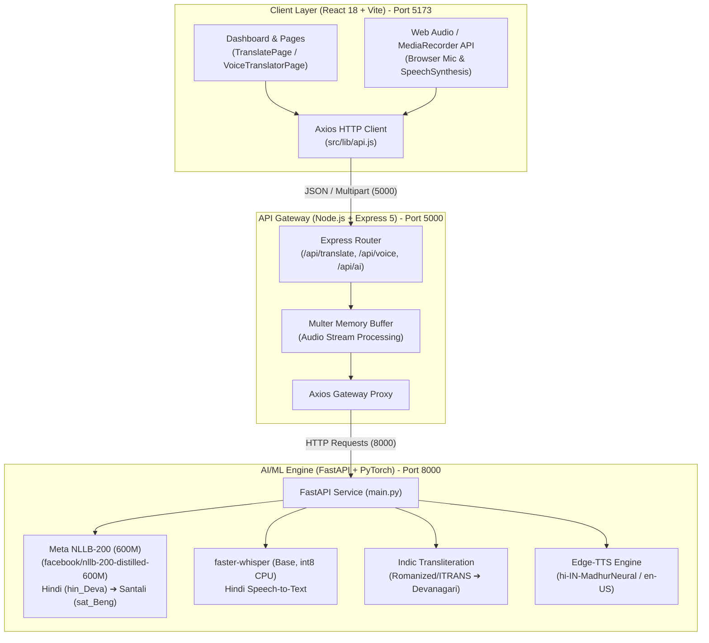

# 🎓 AI-Powered Vernacular Pedagogy

<div align="center">

[](https://opensource.org/licenses/MIT)
[](https://fastapi.tiangolo.com)
[](https://pytorch.org)
[](https://huggingface.co/facebook/nllb-200-distilled-600M)
[](https://nodejs.org)
[](https://expressjs.com)
[](https://react.dev)
[](https://vitejs.dev)
[](https://tailwindcss.com)

**Bridging the linguistic divide in Foundational Literacy and Numeracy (FLN) classrooms by translating educational content and spoken teacher instructions into indigenous tribal languages (Santali / Ol Chiki).**

[Overview](#-the-problem-we-solve) • [Architecture](#-system-architecture) • [File Structure](#-project-file-structure) • [Codebase Deep Dive](#-deep-dive-into-the-three-layers) • [Tech Stack](#-technology-stack) • [Installation & Setup](#-getting-started) • [API Reference](#-api-specification)

</div>

---

## 📖 The Problem We Solve

In many rural and tribal educational belts across India (such as Jharkhand, Odisha, West Bengal, and Chhattisgarh), early childhood learners face a severe **Linguistic Divide** in Foundational Literacy and Numeracy (FLN):

1. **The Medium of Instruction Gap**: Official textbooks and government school teachers predominantly communicate in standard Hindi or English. However, primary school children enter the classroom speaking their indigenous mother tongues—most notably **Santali (ᱥᱟᱱᱛᱟᱲᱤ, written in the Ol Chiki script)**, Mundari, or Ho.
2. **High Cognitive Load & Drop-off**: Young children cannot grasp mathematical fundamentals or basic literacy when concepts are communicated in an unfamiliar tongue. This results in classroom alienation, learning deficits, and elevated dropout rates.
3. **Lack of Vernacular Resources**: Rural teachers often do not speak the local tribal dialects fluently, and there is an acute scarcity of bilingual pedagogical scripts, worksheets, flashcards, and real-time translation aids.

### 💡 Our Solution
**AI-Powered Vernacular Pedagogy** is a unified three-tier platform providing:
* **Neural Text Translation**: High-fidelity translation of Hindi lesson plans, teacher instructions, and pedagogical text into Santali (Ol Chiki script) using Meta's NLLB-200.
* **Speech-to-Voice Pipeline**: Real-time microphone capture of spoken Hindi teacher instructions, transcription via OpenAI's Whisper (quantized for CPU efficiency), translation into Santali, and speech playback.
* **Curriculum & Pedagogical Tools**: Modular generation of worksheets, interactive flashcards, and bilingual classroom scripts designed specifically for Grade 1–3 educators.

---

## 🏛 System Architecture

The repository is built as an end-to-end decoupled system comprising a **Single Page Application Frontend**, a **Node.js API Gateway**, and a **Python PyTorch Machine Learning Engine**.



---

## 📂 Project File Structure

```text
AI-POWERED-VERNACULAR-PEDAGOGY/
│
├── client/                               # React + Vite Frontend
│   ├── public/                           # Static assets
│   ├── src/
│   │   ├── components/
│   │   │   └── ui/                       # Radix-UI + Tailwind modular primitives
│   │   │       ├── button.jsx            # Dynamic variant button component
│   │   │       ├── card.jsx              # Card, CardHeader, CardTitle, CardContent
│   │   │       ├── input.jsx             # Form input field styling
│   │   │       └── label.jsx             # Accessible form label primitive
│   │   ├── lib/
│   │   │   ├── ai-service.js             # Client-side demo fallback service stubs
│   │   │   ├── api.js                    # Centralized Axios client calling Node.js API
│   │   │   ├── curriculum-data.js        # Foundational Grade 1 FLN lesson repository
│   │   │   └── utils.js                  # Tailwind clsx + twMerge helper functions
│   │   ├── pages/
│   │   │   ├── dashboard/
│   │   │   │   ├── CurriculumPage.jsx    # Curriculum overview & syllabus browser
│   │   │   │   ├── DashboardLayout.jsx   # Sidebar navigation and responsive layout
│   │   │   │   ├── DashboardPage.jsx     # Overview metrics and quick-action cards
│   │   │   │   ├── FlashcardsPage.jsx    # Bilingual visual flashcard generator
│   │   │   │   ├── OfflinePage.jsx       # PWA / Low-connectivity cached resources
│   │   │   │   ├── TranslatePage.jsx     # Hindi ➔ Santali text translation & audio
│   │   │   │   ├── VoiceTranslatorPage.jsx # Real-time voice recording & translation
│   │   │   │   └── WorksheetsPage.jsx    # Printable PDF/Canvas worksheet generator
│   │   │   └── LandingPage.jsx           # Hero landing page for the project
│   │   ├── App.jsx                       # React Router DOM configuration
│   │   ├── index.css                     # Tailwind v4 import & custom CSS variables
│   │   └── main.jsx                      # React application root mount point
│   ├── package.json                      # Client dependencies & scripts
│   └── vite.config.js                    # Vite bundler configuration & path aliases
│
├── server/                               # Node.js + Express 5 Middleware Gateway
│   ├── controllers/
│   │   ├── translationController.js      # Proxies text payload to FastAPI /translate
│   │   └── voiceController.js            # Handles audio streaming to /voice-to-voice
│   ├── routes/
│   │   ├── aiRoutes.js                   # Health check endpoint (/api/ai/health)
│   │   ├── translationRoutes.js          # POST /api/translate route
│   │   └── voiceRoutes.js                # POST /api/voice route (Multer-enabled)
│   ├── package.json                      # Express dependencies (multer, axios, cors)
│   └── server.js                         # Express server initialization (Port 5000)
│
├── model/                                # FastAPI + PyTorch AI/ML Microservice
│   ├── speech/
│   │   ├── output/                       # Generated TTS audio cache (.mp3)
│   │   ├── uploads/                      # Temporary ingested voice recordings
│   │   ├── stt.py                        # faster-whisper Speech-to-Text implementation
│   │   └── tts.py                        # edge-tts asynchronous speech synthesis
│   ├── translation/
│   │   ├── __init__.py
│   │   └── translator.py                 # Meta NLLB-200 Seq2Seq model & tokenization
│   ├── utils/
│   │   ├── __init__.py
│   │   └── transliteration.py            # ITRANS to Devanagari Hindi text normalization
│   ├── main.py                           # FastAPI application endpoints (Port 8000)
│   └── requirements.txt                  # Python dependencies (PyTorch, Transformers, etc.)
│
├── .gitignore                            # Unified multi-tier gitignore
└── README.md                             # Comprehensive project documentation
```

---

## 🔍 Deep Dive into the Three Layers

### 1. Client Layer (`client/`)
The frontend is a lightweight, responsive Single Page Application built with **React 18** and bundled with **Vite 6**. It is tailored for low-spec classroom laptops and mobile tablets used by rural school educators.

* **Routing & Layout (`App.jsx`, `DashboardLayout.jsx`)**:
  Uses `react-router-dom` with a persistent responsive sidebar, providing seamless switching between text translation, real-time voice translation, curriculum planning, worksheets, and flashcards.
* **Text Translation Page (`TranslatePage.jsx`)**:
  - Allows the teacher to type or paste Hindi lesson plans and instructional notes.
  - Communicates directly with `api.js` to fetch translations.
  - Implements the **Web Speech API (`SpeechSynthesis`)** with language fallbacks (`hi-IN` and `sat`), giving immediate audio readouts with sound management (`window.speechSynthesis.cancel()` guards).
* **Live Classroom Voice Translator (`VoiceTranslatorPage.jsx`)**:
  - Uses the browser's `navigator.mediaDevices.getUserMedia` and `MediaRecorder` API to capture teacher speech in chunks.
  - Formats recorded audio into binary blobs (`audio/webm`) and dispatches them via multipart form-data to the backend.
  - Visualizes recording status with pulsating visual rings and tracks response latency in milliseconds.
* **UI Primitives (`components/ui/`)**:
  Built on headless Radix UI components styled with **Tailwind CSS v4** for clean typography, accessible color contrasts, and emerald/slate pedagogical design themes.

---

### 2. Server Gateway Layer (`server/`)
The server serves as an orchestration gateway between the frontend web application and the Python AI inference engine.

* **Decoupled Architecture (`server.js`)**:
  Separates business logic and frontend serving from deep learning workloads, preventing client timeouts and enabling independent horizontal scaling.
* **Multipart Audio Buffering (`routes/voiceRoutes.js`, `controllers/voiceController.js`)**:
  - Configures **Multer** using `multer.memoryStorage()`.
  - Ingests uploaded audio directly into RAM as a memory buffer without requiring persistent disk I/O, reducing filesystem churn.
  - Pipes the buffer into `FormData` and streams it to the FastAPI microservice.
* **API Endpoints Exposed**:
  - `GET  /` : Server health ping.
  - `GET  /api/ai/health` : Proxies AI microservice status.
  - `POST /api/translate` : Forwards text translation payloads.
  - `POST /api/voice` : Handles binary audio uploads for voice-to-voice processing.

---

### 3. AI & Model Layer (`model/`)
The AI engine is a high-performance **FastAPI** service running PyTorch and Hugging Face Transformers.

* **Translation Engine (`translation/translator.py`)**:
  - **Model**: Meta's `facebook/nllb-200-distilled-600M` (No Language Left Behind).
  - **Language Code Resolution**: Maps Hindi (`hi`) to `hin_Deva` and Santali (`sat`) to the official NLLB language tag `sat_Beng`.
  - **Ol Chiki Script Generation**: Although indexed via the `sat_Beng` vocabulary token in NLLB, the sequence-to-sequence beam search (`num_beams=4`, `max_length=256`) accurately generates Santali orthography in the native Ol Chiki alphabet (`ᱥᱟᱱᱛᱟᱲᱤ`).
* **Speech-to-Text (`speech/stt.py`)**:
  - Powered by **`faster-whisper`** (OpenAI Whisper re-implemented with CTranslate2).
  - Uses `model_size="base"`, configured on `device="cpu"` with `compute_type="int8"` quantization.
  - Provides rapid (<1s) Hindi speech transcription without requiring expensive dedicated GPUs.
* **Text Normalization (`utils/transliteration.py`)**:
  - Utilizes `indic-transliteration` (`sanscript`).
  - Automatically converts Romanized/Hinglish speech outputs into clean Devanagari Hindi before passing them to the NLLB translation model.
* **Text-to-Speech Engine (`speech/tts.py`)**:
  - Integrates asynchronous **`edge-tts`** using neural voices (`hi-IN-MadhurNeural` for Hindi and `en-US-GuyNeural` for English).
  - Caches generated audio output in `speech/output/` for quick playback.

---

## 🛠 Technology Stack

| Domain | Technology / Framework | Purpose |
| :--- | :--- | :--- |
| **Frontend Framework** | **React 18 + Vite 6** | Fast, modern Single Page Application |
| **Styling & Icons** | **Tailwind CSS v4 + Lucide React** | Utility-first styling & accessible icons |
| **UI Components** | **Radix UI Primitives** | Headless accessible UI components |
| **Client Audio** | **MediaRecorder & Web Speech API** | In-browser audio recording & TTS fallback |
| **API Gateway** | **Node.js + Express 5** | Non-blocking reverse proxy and file streaming |
| **File Handling** | **Multer + FormData** | In-memory audio upload buffering |
| **AI Microservice** | **FastAPI + Uvicorn** | High-performance Python asynchronous REST API |
| **Machine Translation** | **Meta NLLB-200 (600M Distilled)** | Hindi to Santali Seq2Seq translation |
| **Speech Recognition** | **faster-whisper (CTranslate2)** | CPU-quantized (`int8`) Hindi voice transcription |
| **Transliteration** | **indic-transliteration (sanscript)**| Hinglish/ITRANS to Devanagari normalization |
| **Neural TTS** | **edge-tts** | High-quality Indian neural speech synthesis |

---

## 🔧 Key Technical Challenges & Engineering Solutions

### 1. Resolving the NLLB-200 Language Tag Fallback Bug
* **Symptom**: During initial translation tests, inputting Hindi resulted in the model outputting English instead of Santali.
* **Root Cause**: The code specified `"sat": "sat_Olck"`. In Meta's NLLB-200 vocabulary, `"sat_Olck"` does not exist. Calling `tokenizer.convert_tokens_to_ids("sat_Olck")` returned token ID `3` (`<unk>`). Because the target token was unknown, NLLB fell back to English generation.
* **Fix**: Mapped `"sat"` to `"sat_Beng"` (token `256150`), which properly triggers Santali generation in the Ol Chiki script.

### 2. Large Model Ingestion on Low-Memory Devices
* **Symptom**: When booting Uvicorn, the download and RAM allocation of the 2.46 GB safetensors model caused the terminal to freeze under Windows disk paging.
* **Fix**: Model weights are downloaded and cached once in `~/.cache/huggingface/hub/`. The transcription service utilizes 8-bit quantization (`compute_type="int8"` on CPU) via CTranslate2 to keep memory consumption under 2 GB.

### 3. In-Memory Streaming of Audio Files
* **Symptom**: Writing uploaded browser `.webm` audio chunks to server disk resulted in file lock delays and temporary file leaks.
* **Fix**: Multer was configured with `memoryStorage()`, streaming raw bytes directly to FastAPI through Axios multipart form headers.

---

## 🚀 Getting Started

### Prerequisites
* **Node.js**: `v18.0.0` or higher
* **Python**: `3.10` to `3.12`
* **Package Managers**: `npm` and `pip`
* **Git**: Installed and configured

---

### Step 1: Clone the Repository
```bash
git clone https://github.com/SouradeepSaha31/AI-POWERED-VERNACULAR-PEDAGOGY.git
cd AI-POWERED-VERNACULAR-PEDAGOGY
```

---

### Step 2: Set Up & Run the AI Model Service (`model/`)

1. Open a terminal and navigate to the `model` folder:
   ```bash
   cd model
   ```
2. Create and activate a Python virtual environment:
   ```bash
   # Windows (PowerShell)
   python -m venv .venv
   .\.venv\Scripts\Activate.ps1

   # Linux / macOS
   python3 -m venv .venv
   source .venv/bin/activate
   ```
3. Install dependencies:
   ```bash
   pip install -r requirements.txt
   ```
4. Start the FastAPI server on port `8000`:
   ```bash
   uvicorn main:app --reload --port 8000
   ```
   *The first run will automatically download the NLLB-200 translation weights (`~2.46 GB`).*

---

### Step 3: Set Up & Run the API Gateway (`server/`)

1. Open a second terminal and navigate to `server`:
   ```bash
   cd server
   ```
2. Install npm packages:
   ```bash
   npm install
   ```
3. Create a `.env` file (optional, defaults to port 5000):
   ```env
   PORT=5000
   ```
4. Start the Express server:
   ```bash
   npm start
   ```
   *The server runs on `http://localhost:5000`.*

---

### Step 4: Set Up & Run the Client (`client/`)

1. Open a third terminal and navigate to `client`:
   ```bash
   cd client
   ```
2. Install dependencies:
   ```bash
   npm install
   ```
3. Start the Vite development server:
   ```bash
   npm run dev
   ```
4. Open your browser and navigate to:
   ```
   http://localhost:5173
   ```

---

## 📡 API Specification

### 1. Translation Endpoint
* **Route**: `POST /api/translate` (Gateway) ➔ `POST /translate` (Model)
* **Request Body**:
  ```json
  {
    "text": "बच्चों को गिनती सिखाएं",
    "sourceLanguage": "hi",
    "targetLanguage": "sat"
  }
  ```
* **Response**:
  ```json
  {
    "success": true,
    "source_text": "बच्चों को गिनती सिखाएं",
    "translated_text": "ᱜᱤᱫᱽᱨᱟᱹ ᱠᱚ ᱞᱮᱠᱷᱟ ᱪᱮᱫᱚᱜ ᱢᱮ",
    "source_language": "hi",
    "target_language": "sat",
    "confidence": 0.85
  }
  ```

### 2. Voice-to-Voice Translation Endpoint
* **Route**: `POST /api/voice` (Gateway) ➔ `POST /voice-to-voice` (Model)
* **Content-Type**: `multipart/form-data`
* **Body**: `file: <binary audio blob (webm/wav/m4a)>`
* **Response**:
  ```json
  {
    "success": true,
    "input_text": "नमस्ते आज हम संख्या सीखेंगे",
    "translated_text": "ᱡᱚᱦᱟᱨ ᱛᱮᱦᱮᱧ ᱟᱵᱚ ᱮᱞ ᱵᱚᱱ ᱪᱮᱫᱚᱜ-ᱟ",
    "source_language": "hi",
    "target_language": "sat",
    "voice_output_available": false,
    "message": "Santali voice output is not implemented yet."
  }
  ```

### 3. Health Checks
* `GET /api/ai/health`
  ```json
  {
    "status": "ok",
    "model": "nllb-200"
  }
  ```

---

## 🗺 Roadmap & Future Milestones

- [x] **NLLB-200 Hindi ➔ Santali (Ol Chiki) translation engine**.
- [x] **Client-side Speech-to-Text with faster-whisper on CPU**.
- [x] **Bilingual Teacher Dashboard with Audio synthesis**.
- [ ] **Native Santali TTS Model**: Train or integrate an open-source VITS / Indic-TTS model for true synthesized Santali speech output.
- [ ] **Mundari & Ho Language Expansion**: Expand language mappings and fine-tuned datasets to support Ho (`ho`) and Mundari (`un`).
- [ ] **Offline Edge Deployment**: Package the quantized ML pipelines into ONNX runtime for offline deployment on low-cost school tablets without internet connectivity.

---

## 📄 License

This project is licensed under the **MIT License** - see the [LICENSE](LICENSE) file for details.

---

<div align="center">
  <b>Built with ❤️ to empower educators and children in vernacular and tribal classrooms.</b>
</div>

